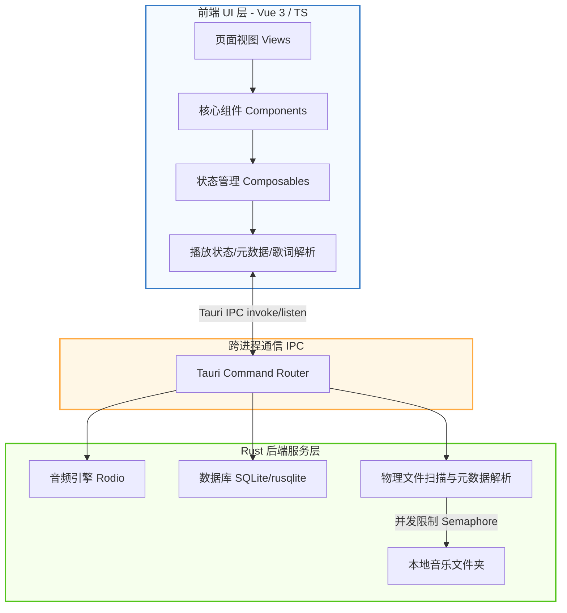

<div align="center">
  
  
  # Lycia Player (铃音播放器)

  一款基于 **Tauri v2** 和 **Vue 3** 构建的现代化、高颜值本地音乐播放器，专为 Windows 平台打造，聚焦于良好的播放体验、歌词显示和系统整合。

  [](./README_EN.md)
  [](https://tauri.app/)
  [](https://vuejs.org/)
  [](https://www.typescriptlang.org/)
  [](https://www.rust-lang.org/)
  [](https://tailwindcss.com/)
  
  [](https://github.com/Billy636/LyciaMusic/commits/dev)
  [](https://github.com/Billy636/LyciaMusic/stargazers)
  [](https://github.com/Billy636/LyciaMusic/graphs/contributors)
  [](./LICENSE)
  [](https://qm.qq.com/cgi-bin/qm/qr?k=xxxx)
</div>

---

> [!IMPORTANT]
> **项目状态：开发阶段 (Alpha)**
> 本项目基于个人兴趣开发。功能会优先围绕作者本人的本地音乐使用场景推进，部分功能测试覆盖仍有限，未经严格测试。如果您在日常使用中遇到问题，欢迎通过 [GitHub Issues](https://github.com/Billy636/LyciaMusic/issues) 反馈。
>
> 个人精力有限，开发节奏较慢。如果您是程序员，或者非常熟悉 AI 辅助编程（Vibe Coding），非常欢迎使用 AI 工具来扩展功能并提交 Pull Request（请优先针对 `dev` 分支进行提交，提交时请尽可能的审核代码，同时自己在本地进行测试确认无误）。

---

## ✨ 功能亮点

* 🎨 **高颜值沉浸式 UI**
  - **动态背景系统**：提供类似 Apple Music 的液态网格渐变效果，背景颜色可根据当前播放曲目的专辑封面色彩动态演变，同时支持静态模糊与自定义用户皮肤。
  - **毛玻璃与美学视觉**：使用高度精致的半透明磨砂设计，与操作系统原生环境完美融合。
  - **响应式界面排版**：经典侧边栏导航，搭配“抽屉式”播放队列设计，提供极佳的交互体验。

* 🚀 **深度性能优化**
  - **秒开防白屏**：深度定制的主窗口冷启动主题色骨架屏，避免任何初始白屏闪烁。
  - **敏捷资源加载**：基于路由的懒加载机制与异步组件挂载，保障界面交互始终保持极高帧率。
  - **安全并发控制**：在 Rust 后端扫描大型音乐库时，采用信号量（Semaphore）对元数据和封面处理进行节流，有效抑制 CPU 突发飙升。

* 🛠️ **系统原生整合**
  - **系统级集成**：完美支持系统媒体通知控制、Windows 媒体按键响应以及系统托盘快速操作。
  - **无缝本地管理**：提供高性能的本地音频文件扫描、标签元数据读取和物理文件重命名与整理。
  - **高级交互体验**：自研智能边界检测的上下文菜单，禁用浏览器默认右键行为，提供真正的原生应用质感。
  - **桌面歌词悬浮窗**：轻量化、高性能的桌面浮窗歌词，支持锁定、穿透与自定义样式。

* 📝 **歌词解析与文件管理**
  - **全格式歌词**：支持音频文件内嵌标签歌词、同名 `.lrc` 文件解析，以及基于 AMLL 的歌词逐字动画渲染。
  - **物理整理与库更新**：内置文件夹管理模式，支持批量重命名预览、外部音频标签编辑器与无感入库刷新。

---

## 📸 界面截图

### 核心界面

| 🎵 首页概览 | 💿 沉浸式播放页 |
| --- | --- |
|  |  |

<details>
<summary>📂 点击展开查看更多功能截图</summary>

### 媒体库与文件管理

| 📂 文件夹视图 | ⚙️ 文件夹管理模式 |
| --- | --- |
|  |  |

### 歌单、统计与辅助功能

| 🎶 歌单页面 | 📊 听歌历史统计 |
| --- | --- |
|  |  |

### 设置与个性化

| 🔧 常规设置 | 📦 音乐库设置 |
| --- | --- |
|  |  |

### 外置功能集成

| 🔗 支持 Lyricify 歌词集成 |
| --- |
|  |

</details>

---

## 🛠️ 使用源码运行

### 环境要求

| 依赖项 | 推荐版本 / 要求 |
| :--- | :--- |
| **Node.js** | `>= 18` |
| **Rust** | Stable 稳定版最新版本 |
| **操作系统** | Windows 10 / 11 |
| **WebView2** | 确保系统已安装 WebView2 运行时 (Windows 11 默认内置) |

### 运行与构建步骤

1. 克隆本仓库：
   ```bash
   git clone https://github.com/Billy636/LyciaMusic.git
   cd LyciaMusic
   ```

2. 安装依赖项：
   ```bash
   npm install
   ```

3. 启动 Tauri 桌面端开发调试：
   ```bash
   npm run tauri dev
   ```

4. 仅在浏览器中调试前端页面：
   ```bash
   npm run dev
   ```

5. 构建生产环境安装包：
   ```bash
   npm run tauri build
   ```

---

## 📐 技术架构

Lycia Player 采用经典的前后端分离架构，通过 Tauri 提供的 IPC 通道进行高性能的跨进程通信：



- **前端技术栈**：Vue 3 (Composition API)、Vite、TypeScript、Tailwind CSS 4.0
- **后端技术栈**：Rust、Tauri v2.0、SQLite (通过 `rusqlite` 实现音乐库高性能索引)
- **音频播放引擎**：基于 `rodio` 库的底层控制

---

## 💝 特别致谢 (Special Thanks)

- **[AMLL (Apple Music-like Lyrics)](https://github.com/Steve-xmh/Apple-Music-Like-Lyrics)**：本项目歌词部分的渲染与适配，深度参考并改编了 AMLL 项目的优秀实现。特此向其作者及所有贡献者致以最诚挚的谢意！

---

## 👥 贡献排行与 Commit 统计

感谢所有通过 Commit 提交、Issue 反馈为 Lycia Player 做出贡献的人！

| 贡献者 | 头像 | 提交数 (Commits) |
| :--- | :---: | :---: |
| **[Billy636](https://github.com/Billy636)** |  | **586** |
| **[Xiyue Cheng](https://github.com/silver-wolf-little-wife)** |  | **7** |

*如果您提交了 Pull Request 并被合并，您的头像和 Commit 数量统计将会在下一次文档更新中在此体现。*

---

## 📈 Star 历史趋势 (Star History)

[](https://star-history.com/#Billy636/LyciaMusic&Date)

---

## ⚖️ 许可与资产声明

- **开源协议**：本项目基于 **AGPL-3.0-only** 许可协议开源，完整协议内容及歌词改编归属说明请分别参阅 [LICENSE](LICENSE) 与 [NOTICE](NOTICE)。
- **资产版权**：本项目内包含的所有视觉资产（包括但不限于应用 Logo、插图、截图等）均属作者个人所有。未经原作者明确授权，请勿将这些图片资产用于任何商业用途或二次分发。

---

*更新日期：2026-06-08*

