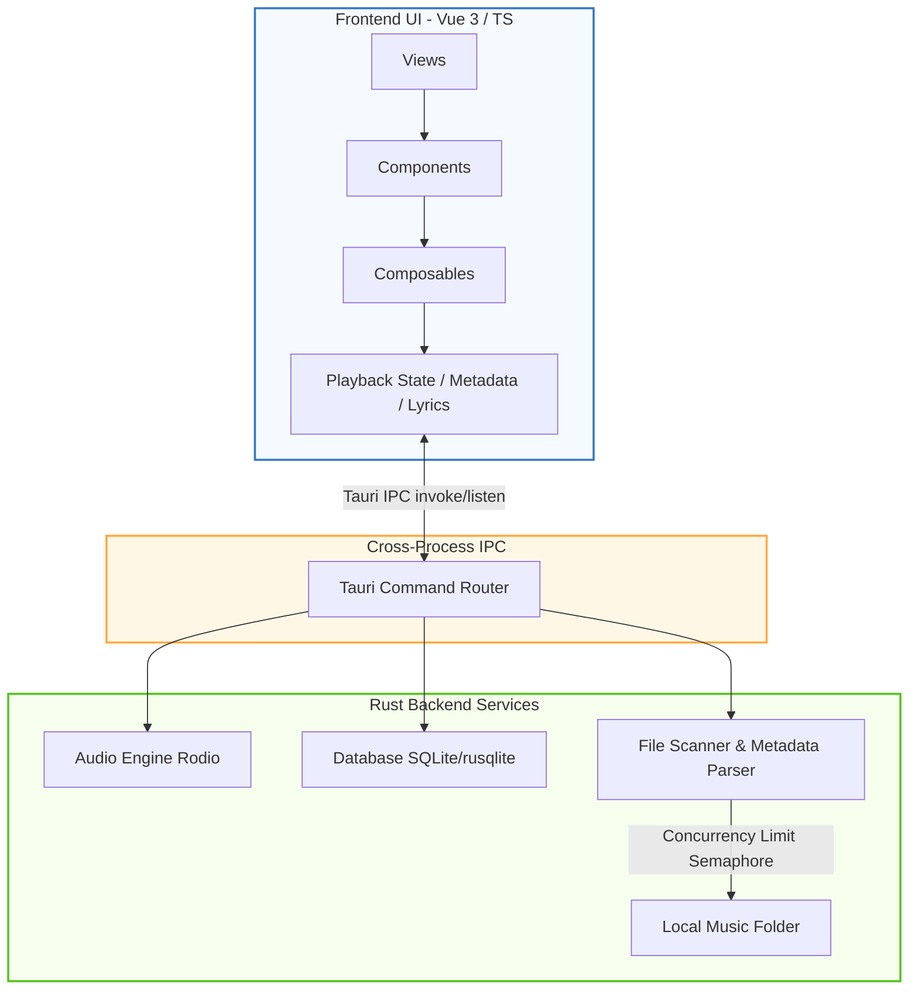

<div align="center">
  
  
  # Lycia Player

  A modern, high-performance, and beautiful desktop local music player built with **Tauri v2** and **Vue 3**. Tailored for Windows, focusing on immersive playback experience, outstanding lyrics display, and seamless system integration.

  [](./README.md)
  [](https://tauri.app/)
  [](https://vuejs.org/)
  [](https://www.typescriptlang.org/)
  [](https://www.rust-lang.org/)
  [](https://tailwindcss.com/)
  
  [](https://github.com/Billy636/LyciaMusic/commits/dev)
  [](https://github.com/Billy636/LyciaMusic/graphs/contributors)
  [](./LICENSE)
  [](https://qm.qq.com/cgi-bin/qm/qr?k=xxxx)
</div>

---

> [!IMPORTANT]
> **Project Status: Under Development (Alpha)**
> This project is developed based on personal interest. Features are prioritized around the author's local music usage scenarios. Test coverage for some features is still limited and has not been thoroughly tested. If you encounter issues during daily use, feel free to report them via [GitHub Issues](https://github.com/Billy636/LyciaMusic/issues).
>
> Due to limited time and energy, development progresses slowly. If you are a developer, or familiar with AI-assisted coding (Vibe Coding), you are more than welcome to expand features using AI tools and submit a Pull Request (please target the `dev` branch as priority).

---

## ✨ Key Features

* 🎨 **Aesthetic & Immersive UI**
  - **Dynamic Background System**: Experience fluid, Apple Music-style liquid mesh gradients that evolve based on album art colors. Supports static blur and custom user skins.
  - **Glassmorphism Visuals**: A polished, translucent interface that blends perfectly with your desktop environment.
  - **Responsive Layout**: Sidebar-driven navigation with a docked "Drawer-style" play queue for seamless interaction.

* 🚀 **Performance Optimized**
  - **Zero-Wait Startup**: Deeply customized main window skeleton screen with theme colors prevents any initial white flash.
  - **Smart Loading**: Route-based lazy loading and asynchronous component mounting ensure the app stays snappy.
  - **Concurrency Control**: Concurrency for image processing and metadata extraction during large music library scans is throttled using Rust semaphores to prevent CPU spikes.

* 🛠️ **Native Desktop Integration**
  - **System Integration**: Fully supports system media notifications, Windows media key controls, and system tray quick actions.
  - **Local Management**: High-performance music file scanning, metadata tag reading, and physical file renaming/organization.
  - **Advanced UX**: Custom context menus with smart boundary detection (auto-flip) and disabled browser defaults for a true native app feel.
  - **Desktop Lyrics**: Lightweight, high-performance floating lyrics overlay, supporting window lock, click-through, and style customization.

* 📝 **Lyrics & File Management**
  - **All-format Lyrics**: Supports embedded tags, external `.lrc` files, and AMLL-based word-by-word lyrics animation.
  - **Physical Organization**: Built-in folder management mode, batch rename preview, external tag editor, and background library refresh.

---

## 📐 Technology Architecture

Lycia Player adopts a classic separation of frontend and backend architecture, utilizing Tauri's IPC channel for high-performance cross-process communication:



- **Frontend Stack**: Vue 3 (Composition API), Vite, TypeScript, Tailwind CSS 4.0
- **Backend Stack**: Rust, Tauri v2.0, SQLite (via `rusqlite` for high-performance indexing)
- **Audio Playback Engine**: Under the hood control powered by the `rodio` library

---

## 📸 Screenshots

### Core Interface

| 🎵 Home Overview | 💿 Immersive Player |
| --- | --- |
|  |  |

<details>
<summary>📂 Click to expand for more feature screenshots</summary>

### Library & File Management

| 📂 Folder View | ⚙️ Folder Management Mode |
| --- | --- |
|  |  |

### Playlists, Statistics & Tools

| 🎶 Playlist Page | 📊 Playback History Stats |
| --- | --- |
|  |  |

### Settings & Personalization

| 🔧 General Settings | 📦 Library Settings |
| --- | --- |
|  |  |

### External Integration

| 🔗 Lyricify Integration Support |
| --- |
|  |

</details>

---

## 🛠️ Run from Source

### Prerequisites

| Dependency | Required Version |
| :--- | :--- |
| **Node.js** | `>= 18` |
| **Rust** | Latest stable release |
| **OS** | Windows 10 / 11 |
| **WebView2** | Ensure WebView2 runtime is installed (Default in Windows 11) |

### Development & Build Steps

1. Clone the repository:
   ```bash
   git clone https://github.com/Billy636/LyciaMusic.git
   cd LyciaMusic
   ```

2. Install dependencies:
   ```bash
   npm install
   ```

3. Start Tauri desktop app in development mode:
   ```bash
   npm run tauri dev
   ```

4. Debug the frontend UI in browser only:
   ```bash
   npm run dev
   ```

5. Build production executable installer:
   ```bash
   npm run tauri build
   ```

---

## 💝 Special Thanks

- **[AMLL (Apple Music-like Lyrics)](https://github.com/Steve-xmh/Apple-Music-Like-Lyrics)**: Adaptations and rendering implementations of lyrics in this project are heavily inspired and adapted from AMLL. Special thanks to the original author and all contributors!

---

## 👥 Contributors & Commit Stats

Thanks to everyone who has contributed to Lycia Player through commits and issue reports!

| Contributor | Avatar | Commits |
| :--- | :---: | :---: |
| **[Billy636](https://github.com/Billy636)** |  | **586** |
| **[Xiyue Cheng](https://github.com/silver-wolf-little-wife)** |  | **7** |

*If you submit a Pull Request and it gets merged, your avatar and commit stats will be shown here in the next document update.*

---

## ⚖️ License & Asset Statement

- **Open Source License**: This project is licensed under the **AGPL-3.0-only** license. See the [LICENSE](LICENSE) and [NOTICE](NOTICE) files for full details and attribution details.
- **Visual Assets Copyright**: All visual assets (including but not limited to application Logos, illustrations, and screenshots) contained in this project belong to the original author. No commercial use or redistribution of these assets is allowed without explicit authorization.

---

*Last Updated: 2026-06-08*

