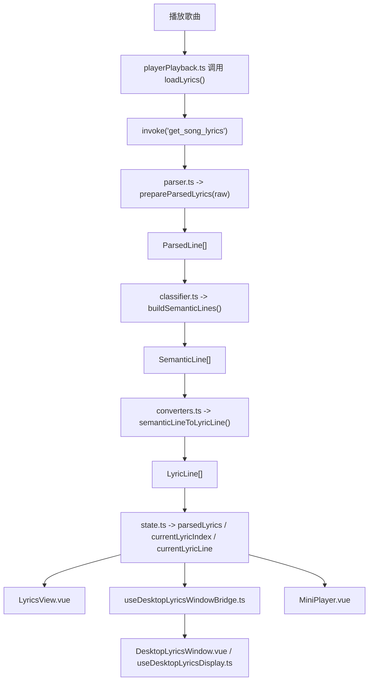
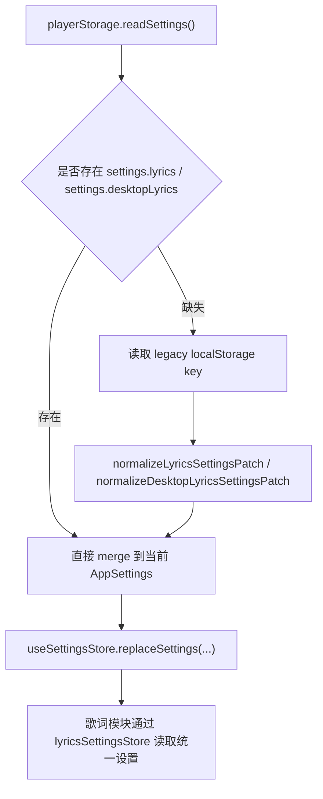

# 当前歌词架构分析

更新时间：2026-04-17  
分析范围：当前工作区内与歌词解析、歌词状态、播放器歌词、桌面歌词、歌词设置持久化直接相关的实现。  
结论口径：以下内容基于现有代码事实整理，不把猜测写成既定结论。

## 1. 总体结论

当前歌词系统已经从“单文件混合实现”演进成了一个相对清晰的分层架构，主链路基本稳定：

1. 歌曲切换时触发歌词加载。
2. 原始歌词文本先进入解析层，统一成 `ParsedLine[]`。
3. 解析结果进入语义分类层，得到 `SemanticLine[]`。
4. 再转换成 UI 和桌面歌词都能消费的 `LyricLine[]`。
5. 播放器歌词、桌面歌词、迷你播放器分别按自己的展示能力消费这些状态。

从代码组织角度看，这一版已经具备继续维护的基础，不急需再做一次大规模重构。真正更值得投入的方向，已经从“继续拆架构”转向“把现有数据能力更完整地映射到用户体验上”。

当前架构的主要优点：

- 解析、语义分类、渲染转换、状态管理、设置持久化已经分层。
- 支持多种歌词格式，并对增强歌词、翻译、音译做了统一归一化。
- 同一份歌词数据可以同时服务播放器歌词和桌面歌词。
- 歌词设置已经并入统一 `AppSettings`，避免了继续分裂存储。
- 对多语种歌词的分组与分类有明确的保守回退路径，不容易“误配错行”。

当前架构仍然存在的主要问题：

- `secondaryTexts` 和 `confidence` 已经在数据层存在，但主要 UI 还没有真正利用起来。
- “无歌词 / 纯音乐 / 非滚动歌词 / 加载失败”这些状态在用户界面的反馈仍然偏粗。
- 桌面歌词虽然结构独立，但窗口几何信息仍然是独立 `localStorage`，没有完全纳入统一设置域。
- 全局歌词状态仍是 composable 级单例 `ref`，运行时可用，但可观察性和调试体验一般。

一句话判断：  
当前歌词架构“够用且可维护”，后续更应该做体验增强和小范围补强，而不是再次做底层大改。

## 2. 相关文件地图

### 2.1 歌词核心模块

| 文件 | 角色 |
| --- | --- |
| `src/composables/lyrics/index.ts` | 歌词模块统一导出入口 |
| `src/composables/lyrics.ts` | 兼容旧引用路径的桥接导出 |
| `src/composables/lyrics/types.ts` | 歌词相关核心类型定义 |
| `src/composables/lyrics/constants.ts` | 默认值、范围、旧存储 key、设置归一化 |
| `src/composables/lyrics/fontUtils.ts` | 字体配置与系统字体加载 |
| `src/composables/lyrics/parser.ts` | 原始歌词文本解析与归一化 |
| `src/composables/lyrics/classifier.ts` | 多语种分组、角色分类、语义行构建 |
| `src/composables/lyrics/converters.ts` | 向 AML/UI/桌面歌词格式转换 |
| `src/composables/lyrics/state.ts` | 全局歌词状态、加载逻辑、当前行计算 |
| `src/composables/lyrics/compat.ts` | 测试/兼容辅助 |

### 2.2 设置与持久化

| 文件 | 角色 |
| --- | --- |
| `src/types/index.ts` | `LyricsSettings`、`DesktopLyricsSettings`、`AppSettings` 定义 |
| `src/features/settings/store.ts` | 统一设置 store，负责 merge 与默认值 |
| `src/features/lyricsSettings/store.ts` | 歌词设置 facade，把歌词设置映射到全局 settings |
| `src/composables/playerLifecycle.ts` | 应用启动时恢复设置，并迁移旧歌词设置 |

### 2.3 运行时消费侧

| 文件 | 角色 |
| --- | --- |
| `src/composables/playerPlayback.ts` | 切歌成功后调用 `loadLyrics()` |
| `src/components/player/LyricsView.vue` | 主播放器歌词视图 |
| `src/composables/useDesktopLyricsWindowBridge.ts` | 主窗口与桌面歌词窗口的数据桥接 |
| `src/composables/useDesktopLyricsDisplay.ts` | 桌面歌词窗口内的显示逻辑 |
| `src/components/player/DesktopLyricsWindow.vue` | 桌面歌词窗口组件 |
| `src/components/settings/SettingsDesktopLyrics.vue` | 桌面歌词设置 UI |
| `src/components/layout/MiniPlayer.vue` | 迷你播放器中对当前歌词的轻量消费 |
| `src/features/desktopLyrics/shared.ts` | 桌面歌词跨窗口事件与 payload 类型 |

## 3. 架构分层总览

当前歌词系统可以分成 5 层：

1. 来源层：Tauri 侧返回某首歌的原始歌词文本。
2. 解析层：把不同格式歌词统一成结构化的 `ParsedLine[]`。
3. 语义层：把同时间点的多行歌词分组成 `SemanticLine[]`。
4. 展示层：把语义行转成 UI 友好的 `LyricLine[]` / AML 行结构。
5. 运行时状态层：根据播放时间定位当前行，并把数据分发到不同界面。

## 4. 数据模型设计

当前架构最大的进步之一，是把“解析事实”和“展示含义”拆开了。

### 4.1 原始文本

原始输入只是字符串，来源于：

- `state.ts` 中的 `invoke('get_song_lyrics', { path })`

这一层不包含任何结构，只负责保存“歌词源文本是否存在”。

### 4.2 `ParsedLine`

`ParsedLine` 是“解析层标准格式”，重点表达的是“歌词文件里实际出现了什么”。

它包含的信息大致有：

- 行开始时间和结束时间
- 行文本
- 行内逐词时间
- 原始来源格式
- 显式角色标记（例如翻译行、音译行）
- 解析器原生给出的 `translatedText` / `romanText`

这一层的职责不是决定“哪一行应该在 UI 上当主歌词显示”，而是尽可能忠实保留解析事实。

### 4.3 `SemanticLine`

`SemanticLine` 是“语义层标准格式”，重点表达的是“这一组同时间点歌词，哪一行是主行、哪一行是翻译、哪一行是音译、哪一行只能保守地放进 secondary”。

它包含的信息大致有：

- `mainText`
- `translationText`
- `romanText`
- `secondaryTexts`
- `mainWords`
- `romanWords`
- `confidence`

这一步把多行并行歌词做了角色收敛，是架构里最关键的一层。

### 4.4 `LyricLine`

`LyricLine` 是当前业务层对外的“通用展示结构”，播放器、桌面歌词、迷你播放器主要消费这一层。

它保留了：

- 主文本 `text`
- 翻译 `translation`
- 音译 `romaji`
- 逐词数据 `words`
- 未被主 UI 利用的 `secondary`

`LyricLine[]` 是当前整个前端歌词消费链路的公共语言。

### 4.5 `RenderLine` / `CurrentLyricDisplayState` / 桌面歌词 payload

这些属于边缘展示模型：

- `RenderLine`：给 AML 风格渲染做中间转换。
- `CurrentLyricDisplayState`：给“当前歌词文案”这种轻量场景使用。
- `DesktopLyricsStatePayload`：给跨窗口同步使用。

它们的存在说明当前架构思路是对的：  
尽量把“歌词理解”留在统一核心层，把“怎么展示”放到边缘转换层。

## 5. 主运行时链路

### 5.1 入口：切歌后触发歌词加载

在 `src/composables/playerPlayback.ts` 中，`playSong()` 在音频真正开始播放后调用 `loadLyrics()`。

这意味着当前歌词加载时机是：

- 已经确定歌曲切换成功
- 当前歌曲引用已经更新
- 播放时钟已经初始化

这种时序是合理的，因为可以避免无效预加载造成的状态错乱。

### 5.2 `state.ts` 负责一次完整歌词加载

`src/composables/lyrics/state.ts` 的 `loadLyrics()` 做了几件核心事情：

1. 增加 `loadRequestId`，用于取消旧请求的结果提交。
2. 清空旧歌词状态，把 `lyricsStatus` 置为 `loading`。
3. 调用 Tauri `get_song_lyrics` 获取原始歌词字符串。
4. 调用 `prepareParsedLyrics(raw)` 解析。
5. 调用 `buildSemanticLines(parsed)` 做语义分组与分类。
6. 调用 `semanticLineToLyricLine()` 映射成最终 `LyricLine[]`。
7. 更新 `semanticLyrics`、`parsedLyrics` 和 `lyricsStatus`。

其中 `loadRequestId` 很关键。它避免了这种竞态：

- 用户连续快速切歌
- A 歌的歌词请求比 B 歌晚返回
- 旧结果覆盖新结果

当前实现会在提交结果前再次校验请求 id 和当前歌曲 path，这个保护是正确的。

### 5.3 当前歌词定位

`currentLyricIndex` 通过二分查找 `parsedLyrics`，使用的时间基准是：

- `playbackStore.currentTime - settingsStore.audioDelay`

这里的 `audioDelay` 来自全局设置中的 `lyricsSyncOffset`。  
也就是说，歌词偏移本质上是“当前播放时间的修正值”，而不是单独改动歌词时间轴。

这种做法的优点：

- 不污染原始歌词数据
- 同一偏移可以同时作用于播放器和桌面歌词
- 调整逻辑简单

### 5.4 当前歌词文案的兜底

`currentLyricLine` 在无有效歌词行时，会走几类 fallback：

- `loading` -> `Loading lyrics...`
- `error` -> `Lyrics unavailable`
- 有原始文本但没解析出同步行 -> `No synchronized lyrics`
- 连原始文本都没有 -> `Instrumental / No lyrics`

这套兜底比“单一空状态”已经好很多，但对用户来说仍然不够细。

## 6. 解析层：`parser.ts`

`src/composables/lyrics/parser.ts` 的职责是把各种歌词格式统一为 `ParsedLine[]`。

### 6.1 支持的来源格式

当前代码里会尝试以下候选解析来源：

- `ttml`
- `qrc`（包含 hex 解密场景）
- `yrc`
- `lys`
- `eslrc`
- `lrc`
- `enhanced_lrc`

解析策略不是“只认一种”，而是：

1. 尝试多个 parser。
2. 收集成功候选。
3. 比较候选质量。
4. 选出最佳结果。

这使得系统对复杂来源更有韧性。

### 6.2 增强 LRC 的处理

增强 LRC 是当前解析层里比较重要的一部分。

实现特点：

- 先从文本中解析增强 LRC 行和逐词时间。
- 再尝试找一个普通基线候选。
- 如果找到，就通过 `mergeEnhancedLinesIntoBaseLines()` 把增强信息合并回基线行。

这种策略的价值在于：

- 保留增强 LRC 的逐词精度
- 同时尽量利用普通解析器已有的翻译/音译信息

这是一个很实用的工程折中方案，不是纯理论最优，但对实际歌词来源更稳。

### 6.3 显式角色识别

解析层会尽量识别某些“这就是翻译 / 这就是音译”的明确迹象，例如：

- 行内容中的标记模式
- parser 原生输出的 `translatedLyric`
- parser 原生输出的 `romanLyric`

这一步很关键，因为一旦有显式证据，后续分类层就可以少依赖启发式判断。

### 6.4 解析层的输出特征

`prepareParsedLyrics(raw)` 返回的结果具有几个重要特征：

- 已经过滤掉空行或无效行
- 已按开始时间排序
- 结束时间会被归一化处理
- 每一行都尽量保留其来源和附加信息

这使得后续分类层可以专注于“如何理解这些行”，而不是继续做来源适配。

### 6.5 解析层的优点与边界

优点：

- 输入兼容性强
- 把复杂来源差异集中在一处
- 为后续语义判断保留了足够证据

边界：

- 解析层只能回答“歌词文件里给了什么”
- 不能直接回答“哪一行应该显示在最上面”
- 语种角色判断仍然要依赖分类层

## 7. 语义分类层：`classifier.ts`

`src/composables/lyrics/classifier.ts` 是当前歌词架构里最有价值的部分。

它解决的是这个核心问题：  
同一个时间点出现 2 到 3 行歌词时，系统如何判断哪一行是主歌词、哪一行是翻译、哪一行是音译。

### 7.1 分组策略

分类前，系统会先把 `ParsedLine[]` 按时间邻近程度分组。

当前几个关键约束：

- `MAX_GROUP_TOLERANCE_MS = 50`
- `MAX_GROUP_SIZE = 3`
- 实际分组容差不是固定值，还会参考前后行间距做自适应缩放

这种设计的目的，是在两种风险之间取平衡：

- 容差太小：本来属于同一时刻的中日双行被拆开
- 容差太大：快节奏同语种连续歌词被误并组

当前实现还专门限制了同语种密集歌词的误合并，这一点对实际听感影响很大。

### 7.2 角色判定优先级

分类层的优先级大致如下：

1. 先相信显式标记。
2. 再相信 parser 原生提供的翻译/音译。
3. 最后才用启发式脚本判断。

这是合理的，因为“明确证据”永远应该比“根据字符集猜测”更可信。

### 7.3 启发式主行选择

当前启发式会根据脚本特征识别：

- Kana
- Hangul
- Han
- Latin

并据此推断：

- 日文/韩文主行旁边的纯 Latin 更可能是音译
- 日文/韩文主行旁边的纯 Han 更可能是翻译
- 中文主行旁边的纯 Latin 更可能是拼音/音译
- 其他无法稳定识别的内容，保守地归入 `secondary`

这套规则并不是“永远正确”，但当前策略的优点是：  
宁可保守，也尽量不要把本来是正文的行错误标成翻译。

### 7.4 `confidence` 的意义

当前分类结果会带一个 `confidence`：

- `explicit`
- `parser-native`
- `heuristic`

这说明架构已经具备“对分类可靠性做分层”的能力。  
这是很重要的基础能力，因为未来如果要做更细的 UX，例如：

- 低置信度场景给出不同展示策略
- Devtools 或调试面板显示歌词分类依据
- 为 ambiguous 行提供手动纠正入口

都已经有数据抓手。

### 7.5 `secondaryTexts` 的意义

对无法安全归类的歌词行，当前会进入 `secondaryTexts`。

这是一种正确的保守设计，因为它避免了最糟糕的错误：

- 把正文误识别成翻译
- 把翻译误识别成音译
- 把不同版本的主歌词强行合并

从架构角度看，这是“质量优先于表面完整性”的策略。

从产品角度看，这也留下了一个待补的口子：  
数据没有丢，但 UI 还没充分显示它。

### 7.6 逐词音译对齐

分类层还会尝试把 `mainWords` 和 `romajiWords` 对齐。

如果主词和音译词数量一致，并且时间差在容忍范围内，就会生成逐词音译数据。  
这直接服务于：

- AML 风格逐词动画
- 桌面歌词逐词高亮
- 更细粒度的音译显示

这说明当前架构不是只处理“整行文本”，而是已经兼顾到了词级数据。

## 8. 展示转换层：`converters.ts`

`src/composables/lyrics/converters.ts` 负责把语义结果转成各个界面能直接用的格式。

### 8.1 `SemanticLine -> RenderLine`

`toRenderLine()` 会根据 `showTranslation` / `showRomaji` 决定：

- 主行片段怎么生成
- 翻译是否暴露
- 音译是否暴露
- `secondary` 是否保留

这是一个很好的边界设计：  
语义层不关心“用户现在勾没勾选显示翻译”，转换层才关心。

### 8.2 `SemanticLine -> LyricLine`

`semanticLineToLyricLine()` 把核心数据映射成通用业务模型。

这里有一个非常关键的事实：  
`secondaryTexts` 会进入 `LyricLine.secondary`，并没有丢。

也就是说：

- 解析层没有丢
- 分类层没有丢
- 转换层也没有丢
- 只是当前主要展示组件还没有消费它

这会影响后面对 UX 问题的判断：  
当前短板主要不是“底层能力缺失”，而是“展示策略还没跟上”。

### 8.3 AML 转换

`convertLyricsToAmlLines()` 会把 `LyricLine[]` 转成 `@applemusic-like-lyrics/core` 所需结构。

它处理了：

- 行开始/结束时间
- 逐词高亮时间
- 翻译行
- 音译行
- 行尾和词尾的最小时间补偿

这层实现的意义是把第三方歌词渲染能力隔离在边缘，避免内部核心类型被 AML 绑死。

### 8.4 当前显示行转换

`getCurrentLyricDisplayLines()` 和 `getDisplaySubtitles()` 主要服务：

- 当前歌词小视图
- 桌面歌词副行
- 轻量字幕式展示

但当前它们只会使用：

- `main`
- `romaji`
- `translation`

不会使用 `secondary`。

这是一个明确的功能缺口。

## 9. 状态层：`state.ts`

`src/composables/lyrics/state.ts` 是当前歌词系统的运行时中枢。

### 9.1 当前维护的核心状态

公开状态：

- `showDesktopLyrics`
- `showLyricsPlayerSettingsPanel`
- `lyricsStatus`
- `parsedLyrics`
- `currentLyricIndex`
- `currentLyricLine`

内部状态：

- `rawLyrics`
- `semanticLyrics`
- `loadRequestId`

这意味着当前状态层既保存：

- 原始来源
- 中间语义结果
- 对外最终展示结果

优点是调试时能追踪不同阶段数据。  
代价是存在一定的数据冗余。

### 9.2 歌词设置代理

`lyricsSettings` 和 `desktopLyricsSettings` 当前不是独立 store 本体，而是通过 `createSettingsProxy()` 代理到 `useLyricsSettingsStore()`。

这个设计的好处：

- 调用侧仍然能用对象属性直写的方式更新设置
- 底层更新会自动进入统一 settings store
- 不需要在视图层到处写 `patchSettings({ ... })`

这个设计的代价：

- 可读性依赖于团队知道这是 Proxy
- 调试时对象来源不如显式 `computed` 直观
- 对不熟悉实现的人来说，行为是“有一点隐式的”

但从工程实用角度，它当前是可接受的。

### 9.3 当前架构对时间同步的处理

当前歌词时间同步只有一个统一入口：`audioDelay`。  
播放器歌词和桌面歌词都共享它。

这带来了明显好处：

- 用户只调一次偏移
- 不会出现主播放器对了、桌面歌词又偏的双重状态
- 系统心智一致

### 9.4 当前状态层的优势

- 单一入口负责歌词加载
- 有明确的请求竞态保护
- 当前行计算简单可靠
- 所有主要消费方都基于同一份 `parsedLyrics`

### 9.5 当前状态层的边界

- 它仍然是 composable 级单例，而不是专门的非持久化歌词 store
- `rawLyrics`、`semanticLyrics`、`parsedLyrics` 同时存在，会有少量重复内存
- 空状态文案和错误语义还没有进一步枚举化

总体上这些更像“可继续优化项”，不是当前必须推倒重来的问题。

## 10. 设置与持久化链路

歌词相关设置现在已经正式进入统一设置体系。

### 10.1 设置类型

`src/types/index.ts` 中新增并维护：

- `LyricsSettings`
- `DesktopLyricsSettings`
- `AppSettings.lyrics`
- `AppSettings.desktopLyrics`

这说明歌词设置已经从“散落的局部状态”升级成“应用设置的一部分”。

### 10.2 统一 merge 和默认值

`src/features/settings/store.ts` 负责：

- 为 `lyrics` 和 `desktopLyrics` 提供默认值
- 在 `mergeAppSettings()` 中做嵌套 merge
- 继续把 `lyricsSyncOffset` 暴露为 `audioDelay`

这一步很重要，因为它避免了下面这些问题：

- 局部设置对象被整块覆盖
- 新增字段后旧数据丢失默认值
- 歌词设置和其他设置使用不同 merge 规则

### 10.3 歌词设置 facade

`src/features/lyricsSettings/store.ts` 的职责很轻：

- 把 `settingsStore.settings.lyrics` 映射出来
- 把 `settingsStore.settings.desktopLyrics` 映射出来
- 提供 patch / replace 方法

这层的价值主要是隔离调用方，避免所有组件都直接感知完整 `AppSettings` 结构。

### 10.4 旧数据迁移

`src/composables/playerLifecycle.ts` 会在恢复应用设置时：

- 先读取新的统一 settings
- 如果发现新 settings 中没有 `lyrics` 或 `desktopLyrics`
- 再尝试从旧的 `lyrics_settings` / `desktop_lyrics_settings` 读取
- 通过 normalize 逻辑补到新的 `AppSettings`

这个迁移策略是稳的，因为它满足几个条件：

- 有新字段就优先新字段
- 只有缺失时才读旧字段
- 旧字段进入新结构前会先归一化

### 10.5 仍未统一的部分

桌面歌词窗口的几何信息仍然单独保存在：

- `desktop_lyrics_window_bounds`

位置在：

- `src/composables/useDesktopLyricsWindowBridge.ts`
- `src/features/desktopLyrics/shared.ts`

这不算错误，但它意味着当前“歌词相关配置”还没有做到百分百统一。

是否要继续统一，要看产品取舍：

- 如果目标是“尽量少动现有稳定逻辑”，现在这样可接受。
- 如果目标是“所有歌词配置都进入同一设置域”，那这里仍有收口空间。

## 11. 主播放器歌词视图

`src/components/player/LyricsView.vue` 是主播放器歌词消费端。

### 11.1 当前能力

它做的事情包括：

- 读取 `parsedLyrics`
- 调用 `convertLyricsToAmlLines()`
- 使用 `audioDelay` 修正 AML 当前时间
- 提供翻译显示开关
- 提供音译显示开关
- 提供字体、对齐、偏移、行距设置

从结构上看，主播放器歌词已经不再负责“理解歌词”，而只是负责“渲染歌词”。  
这是当前架构比较成熟的一个标志。

### 11.2 当前限制

主播放器歌词虽然支持：

- 主行
- 翻译
- 音译

但不支持：

- `secondary`
- `confidence` 感知型展示

所以在模糊分类场景下，底层并没有真正丢数据，但主视图看起来仍然像“少了一行”。

## 12. 桌面歌词架构

桌面歌词当前采用“主窗口状态源 + 独立窗口展示”的双端结构。

### 12.1 主窗口桥接职责

`src/composables/useDesktopLyricsWindowBridge.ts` 负责：

- 创建/销毁桌面歌词窗口
- 把完整状态打包成 `DesktopLyricsStatePayload`
- 把高频播放时钟打包成 `DesktopLyricsPlaybackPayload`
- 监听桌面歌词窗口发回的交互动作
- 同步窗口顶置状态
- 读写窗口 bounds

这是一个典型的 bridge 层设计，职责边界是清晰的。

### 12.2 同步策略

当前同步分两类：

- 全量状态同步：在歌词、设置、歌曲、主题色等变化时触发
- 播放时钟同步：每 400ms 发送一次简化 payload

这种设计是合理的，因为：

- 不需要每 400ms 都深拷贝整份歌词
- 高刷新的只有时间数据
- 桌面歌词窗口可以本地推演播放时间

### 12.3 窗口侧显示逻辑

`src/composables/useDesktopLyricsDisplay.ts` 负责：

- 接收主窗口的全量状态和播放同步
- 本地修正播放时钟
- 根据当前时间定位当前歌词
- 构建桌面歌词的副行列表
- 处理桌面歌词窗口内设置变更并回传主窗口

### 12.4 桌面歌词当前的优点

- 显示逻辑与主窗口解耦
- 窗口状态同步模型清晰
- 支持逐词高亮
- 支持字体、对齐、偏移、颜色方案、置顶、锁定等丰富设置

### 12.5 桌面歌词当前的限制

桌面歌词的 `visibleSecondaryLines` 当前只会消费：

- `romaji`
- `translation`

不会消费：

- `secondary`

因此它和主播放器存在同样的问题：  
底层数据有保留，但最终展示没有体现。

## 13. 迷你播放器的歌词消费

`src/components/layout/MiniPlayer.vue` 当前只轻量使用了 `currentLyricLine.text`。

特点是：

- 只展示主行
- 空闲 5 秒后才显示
- 不显示翻译
- 不显示音译
- 不显示 `secondary`

这是一种有意收缩的产品选择，不一定是问题。  
但从用户体验角度看，当前迷你播放器对歌词能力的利用率确实偏低。

## 14. 当前用户体验视角下的评价

从用户体验角度，不应该只看“代码是否优雅”，而要看“用户能感知到什么”。

### 14.1 当前已经明显改善的体验

- 多语种歌词误分组、误分类的概率降低了。
- 翻译和音译开关已经统一接入设置体系。
- 主播放器和桌面歌词共享同一套偏移，用户心智简单。
- 桌面歌词具备较完整的显示调节能力。

### 14.2 当前仍然存在的体验缺口

#### 1. `secondary` 没有形成真实可见能力

数据层已经保留了 `secondary`，但主播放器和桌面歌词都没真正显示。  
结果就是：系统明明已经“谨慎地保住了多余那一行”，用户却仍然只会感受到“歌词少了一行”。

#### 2. 状态提示还不够细

当前用户看到的主要是：

- `Loading lyrics...`
- `Lyrics unavailable`
- `No synchronized lyrics`
- `Instrumental / No lyrics`

这还不能很好地区分：

- 没找到歌词
- 只有非滚动歌词
- 解析失败
- 歌词源为空
- 歌词被保守分类后没有副行展示

#### 3. 低置信度结果没有 UX 区分

`confidence` 已存在，但当前没有转成用户可感知的策略。  
比如：

- 显示额外副行
- 改变副行优先级
- 提供轻量提示

这些现在都还没有落地。

#### 4. 迷你播放器没有吃到完整能力

迷你播放器只是“顺手展示一句当前主歌词”，还不是“歌词场景的完整补充入口”。

## 15. 当前架构的优点

如果只从工程实现角度评价，当前歌词架构有以下明显优点：

### 15.1 分层边界清晰

- 解析层解决格式兼容
- 分类层解决语义归位
- 转换层解决展示适配
- 状态层解决运行时同步

这比把所有逻辑塞进单个 composable 容易维护得多。

### 15.2 兼容性和保守性平衡得比较好

当前实现既支持：

- parser 原生 secondary
- 多格式歌词
- 逐词数据
- 中日韩及 Latin 脚本识别

又保留了 `secondary` 和 `confidence`，避免把不确定内容强行解释错。

### 15.3 设置链路已经收口

歌词设置现在和应用设置共用同一套恢复与持久化链路，长期维护成本明显下降。

### 15.4 播放器和桌面歌词共享一套核心数据

这避免了：

- 两套歌词解析逻辑
- 两套偏移校准逻辑
- 两套多语种分类逻辑

统一性是当前架构非常大的优势。

## 16. 当前架构的不足与风险

### 16.1 运行时状态仍是 composable 级单例

这不是 bug，但意味着：

- Devtools 中的可观测性一般
- 复杂联动调试时不如显式 store 清楚
- 后续如果继续扩展歌词交互，可能更想要专门的运行时 store

### 16.2 `semanticLyrics` 的能力没有被完整消费

当前主消费方基本都停在 `LyricLine[]`。  
这使得 `SemanticLine` 中更丰富的信息没有被充分传到界面。

### 16.3 桌面歌词桥接需要深拷贝歌词数组

`useDesktopLyricsWindowBridge.ts` 在发送全量状态时会对 `parsedLyrics` 做 JSON 深拷贝。  
好处是跨窗口 payload 干净、不会携带响应式引用。  
代价是状态同步时会有一次完整复制。

这个代价当前通常可接受，因为：

- 歌词行数有限
- 高频同步只传时间，不传整份歌词

但它仍然是一个值得知道的实现事实。

### 16.4 窗口 bounds 仍是独立存储

这会带来两个结果：

- 好处：窗口位置恢复逻辑简单，不必牵动整体设置结构
- 代价：歌词相关配置源头不完全统一

## 17. 测试覆盖现状

当前歌词相关测试已经覆盖了几类关键场景：

- 英文主行 + 中文翻译
- 日文主行 + 中文翻译 + romaji
- 韩文主行 + 中文翻译
- 中文主行 + 拼音
- 增强 LRC 逐词时间 + 翻译
- 时间戳轻微漂移的安全合并
- 高频同语种歌词不误合并
- 模糊同语种分组落入 `secondary`
- 歌词设置 merge 与归一化

相关测试文件：

- `src/composables/lyrics.test.ts`
- `src/features/settings/store.test.ts`

这说明当前架构已经不只是“看起来分层”，而是关键规则有测试兜底。

## 18. 是否还需要继续做架构优化

结论是：  
仍有优化空间，但不建议再做“大重构式架构优化”。

更合理的判断是：

- 核心架构已经基本成型
- 后续应该做“围绕现有架构的小步增强”

### 18.1 更值得做的方向

#### 1. 让 `secondary` 真正进入展示层

这是当前投入产出比最高的一项。  
底层能力已经有了，主要差的是：

- 展示规则
- 样式层级
- 是否默认展示或按低置信度展示

#### 2. 细化歌词状态模型

如果后续要继续提升体验，建议把空状态进一步细分成更明确的原因码，而不是只靠当前几个字符串兜底。

#### 3. 在必要时再引入非持久化歌词 store

如果后续歌词功能继续膨胀，例如：

- 手动纠正分类
- 调试面板
- 歌词来源切换
- 多版本歌词选择

那再把当前 `state.ts` 收敛到一个专门运行时 store 会更有价值。  
但以当前产品复杂度看，还不是必须立刻做的事。

#### 4. 视需要统一桌面歌词窗口 bounds

这是“配置统一性”层面的收口，不是用户最强感知点，优先级应低于展示层和状态反馈优化。

## 19. 最终判断

当前歌词架构已经具备以下特征：

- 核心链路清晰
- 关键职责分层明确
- 多语种歌词分类有比较稳的保守策略
- 设置持久化已经收口
- 主播放器和桌面歌词共享统一数据源

它现在最需要的，不是再做一次底层推倒重来，而是把已经存在的数据能力更完整地兑现到用户体验上。

如果用一句话概括当前状态：

> 这套歌词架构已经从“能跑”进化到了“能维护”，下一阶段的重点应该是“能让用户感知到它已经更聪明了”。
